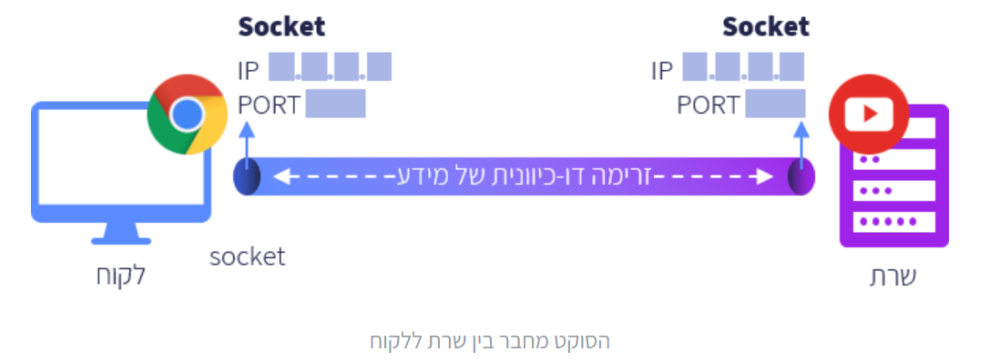

# Networks tutorial
Tutorial for the working with networks, based on the course of campus.il.  
in addition, I would like to manage an operation in the Jenkins, related to the project updates.  

## 1.2 What is the internet network?

**Internet (World Wide Web)** - a global communication network, that connects computer networks.  
**Client** - any application or software which asks for data from the server. The client applications are operated by the end users.  
**Server** - a computer that shares data with the clients.  
**Browser** - The browser is an application that allows showing internet pages. The browser is defined as a client-side application.  
**IP address** - the address of each equipment that connects to the internet network (IP - Internet Protocol). The IP address consists of four numbers in the ranges of 0-255, separated by dots.  
 
The command 'ipconfig' in the command line allows revealing the IP address of a device (usually under "Wireless LAN adapter Wi-Fi").  
The command 'ping' in the command line allows revealing if two computers are linked one to the other through the internet network.  

## 1.3 Communication protocols and the layers model

**Communication Protocol** - different devices use a "common language" to communicate each with other. The protocol defines the rules for such communication.
The protocols consist of Header (general data) and data (the content).  
**Standards** - Protocols that were accepted and agreed upon by experts.  
**The layers model** - The internet network is divided into different layers. for each layer, the protocols define how to operate in the layer.  
**The application layer** - The end user uses the application. the application requests data from the server and gets it. examples for applications: phone applications, online games, and internet browsers.  
**The transport layer** - this layer directs the data from/to different applications on different devices. it uses the IP addresses and port numbers. The data move from one computer to the other in packets - small data units. the TCP protocol and the UDP protocol are examples of protocols that define the operation of the transport layer.  
 
**TCP protocol (Transmission Control Protocol)** - uses for reliable communication. The data will transport fully and in the right manner. The protocol adds a sequence number to each packet. In addition, the protocol uses acknowledgment - the receiver side informs the sender that he received the data properly.  
**UDP protocol (User Datagram Protocol)** - unreliable protocol. The advantage of this protocol is the speed of the data transfer. it uses for tasks that do not require reliability, such as video calls (where speed is more important).   

## 2.2 Socket 
**Socket** - We can think of the communication between a client and a server or between two applications as a "tube". The socket is one of the tube's holes.
The message transmitted through the socket should contain the IP address and the port number of the receiver, and the IP address and the port number of the sender. Through the socket, the data is transmitted in units of bytes.  
**Well-known ports** - Ports that are saved for common protocols (e.g. port 80 - saved for HTTP protocol communication).  

## 2.3 Client (TCP)

**Stages:**  
1. create a socket.  
2. Connect to the server.  
3. Send data.  
4. Recieve data.  
5. Close the socket.  
 
'socket.AF_INET' - IP Protocol - The socket connects between two IP addresses.    
'socket.SOCK_STREAM' - TCP Protocol.  
'recv(1024)' - 1024 is the maximum bytes we can receive from the socket.  

## 2.4 Server (TCP)

**Stages:**  
1. create a socket.  
2. Assign an IP address and port number.  
3. Listen.  
4. Connection to the Client.  
5. Recieve data.  
6. Send data.  
7. Disconnection from the Client.  
8. Close the socket.  

"0.0.0.0" - listen to everybody.  
